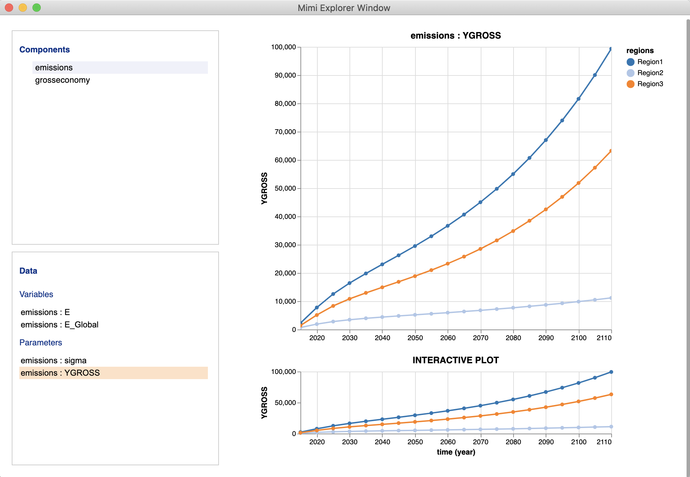
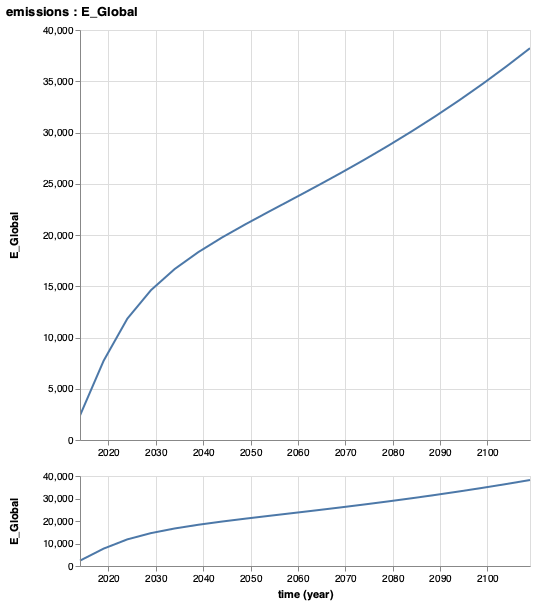

# How-to Guide 2: View and Explore Model Results

This guide show show to access the numerical values of your results in a usable format, and also how to plot your results.

## Accessing Results

After a model has been run, you can access the results (the calculated variable values in each component) in a few different ways.

You can use the `getindex` syntax as follows:

```julia
m[:ComponentName, :VariableName] # returns the whole array of values
m[:ComponentName, :VariableName][100] # returns just the 100th value
```

Indexing into a model with the name of the component and variable will return an array with values from each timestep.
You can index into this array to get one value (as in the second line, which returns just the 100th value). Note that if the requested variable is two-dimensional, then a 2-D array will be returned.

You can also get data in the form of a dataframe, which will display the corresponding index labels rather than just a raw array. The syntax for this is:

```julia
getdataframe(m, :ComponentName=>:Variable) # request one variable from one component
getdataframe(m, :ComponentName=>(:Variable1, :Variable2)) # request multiple variables from the same component
getdataframe(m, :Component1=>:Var1, :Component2=>:Var2) # request variables from different components
```

## Plotting and the Explorer UI

Mimi provides support for plotting using [VegaLite](https://github.com/vega/vega-lite) and [VegaLite.jl](https://github.com/fredo-dedup/VegaLite.jl).

Plotting support is provided by the **Explorer UI**, rooted in `VegaLite`.  The `explore` function allows the user to view and explore the variables and parameters of a model run.  The explorer can be used in two primary ways.

In order to invoke the explorer UI and explore all of the variables and parameters in a model, simply call the function `explore` with the model run as the required argument, and a window title as an optional keyword argument, as shown below.  This will produce a new browser window containing a selectable list of parameters and variables, organized by component, each of which produces a graphic.  The exception here being that if the parameter or variable is a single scalar value, the value will appear alongside the name in the left-hand list.
 
```julia
run(m)
explore(m, title = "run1 results")
```



Alternatively, in order to view just one parameter or variable, call the (unexported) function `Mimi.plot` as below to return a plot object and automatically display the plot in a viewer, assuming `Mimi.plot` is the last command executed.  Note that `plot` is not exported in order to avoid namespace conflicts, but a user may import it if desired. This call will return the type `VegaLite.VLSpec`, which you may interact with using the API described in the [VegaLite.jl](https://github.com/fredo-dedup/VegaLite.jl) documentation.  For example, [VegaLite.jl](https://github.com/fredo-dedup/VegaLite.jl) plots can be saved as [PNG](https://en.wikipedia.org/wiki/Portable_Network_Graphics), [SVG](https://en.wikipedia.org/wiki/Scalable_Vector_Graphics), [PDF](https://en.wikipedia.org/wiki/PDF) and [EPS](https://en.wikipedia.org/wiki/Encapsulated_PostScript) files. You may save a plot using the `save` function.  

Note that saving an interactive plot in a non-interactive file format, such as .pdf or .svg will result in a warning `WARN Can not resolve event source: window`, but the plot will be saved as a static image. If you wish to preserve interactive capabilities, you may save it using the .vegalite file extension. If you then open this file in Jupyter lab, the interactive aspects will be preserved.

```julia
using VegaLite
run(m)
p = Mimi.plot(m, :ComponentName, :ParameterName)
save("figure.svg", p)
```


These two functions, `explore` and `plot` also have methods applicable to the sensitivity analysis support described in the next section. Details can be found in the sensitivity analysis how-to guide How-to Guide 3: Conduct Sensitivity Analysis as well as Tutorial 4: Sensitivity Analysis (SA) Support.
