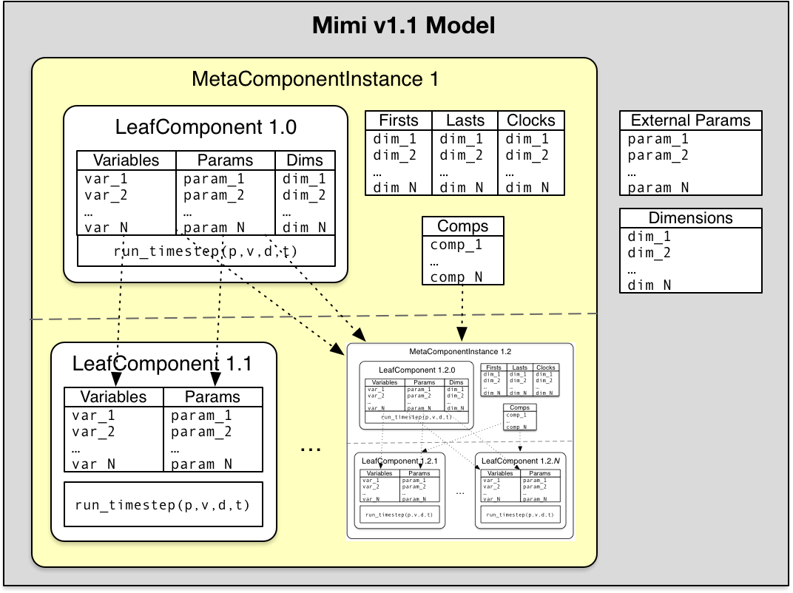

# Composite Components

## Goals

In Mimi v0.4, we have two levels of model elements, (i) `Model` and (ii) `Component`. (For now, we ignore the distinction between model / component "definition" and "instance" types.) The primary goal of the `MetaComponent` construct is to extend this structure recursively to _N_ levels, by allowing a `MetaComponent` to contain other `MetaComponent`s as well as `LeafComponent`s, which cannot contain other components.

## Major elements
This suggests three types of elements:

1. `LeafComponent(Def|Instance)` -- equivalent to the Mimi v0.4 `Component(Def|Instance)` concept.

1. `MetaComponent(Def|Instance)` -- presents the same API as a `LeafComponent(Def|Instance)`, but the variables and parameters it exposes are the aggregated sets of variables and parameters exposed by its components, each of which can be a `MetaComponent` or `LeafComponent`. A `MetaComponentInstance` creates no new storage for variables and parameters; it references the storage in its internal components. By default, the `run_timestep` method of a `MetaComponentInstance` simply calls the `run_timestep` method of each of its internal components in dependency order. 

1. `Model` -- Contains a top-level `MetaComponentInstance` that holds all the actual user-defined components, which are instances of `MetaComponentInstance` or `LeafComponentInstance`. The API for `Model` delegates some calls to its top-level `MetaComponentInstance` while providing additional functionality including running a Monte Carlo simulation.

## Implementation Notes

### Model

* A `Model` will be defined using the `@defmodel` macro.

* As with the currently defined (but not exported) `@defmodel`, component ordering will be determined automatically based on defined connections, with loops avoided by referencing timestep `[t-1]`. This simplifies the API for `addcomponent!`.

* We will add support for two optional functions defined inside `@defmodel`:
  * `before(m::Model)`, called before the model runs its first timestep
  * `after(m:Model)`, called after the model runs its final timestep.

* A `Model` will be implemented as a wrapper around a single top-level `MetaComponent` that handles the ordering and iteration over sub-components. (In an OOP language, `Model` would subclass `MetaComponent`, but in Julia, we use composition.)

### MetaComponent

* Defined using `@defcomp` as with `LeafComponent`. It's "meta" nature is defined by including a new term:
    
    `subcomps = [sc1, sc2, sc3, ...]`, where the referenced sub-components (`sc1`, etc.) refer to previously defined `ComponentId`s.

* A `MetaComponent`'s `run_timestep` function is optional. The default function simply calls `run_timestep(subcomps::Vector)` to iterate over sub-components and calls `run_timestep` on each. If a `MetaComponent` defines its own `run_timestep` function, it should either call `run_timestep` on the vector of sub-components or perform a variant of this function itself.

* The `@defcomp` macro allows definition of an optional `init` method. To this, we will add support for an `after` method as in `@defmodel`. We will allow `before` as an alias for `init` (perhaps with a deprecation) for consistency with `@defmodel`.

## Other Notes

* Currently, `run()` calls `_run_components(mi, clock, firsts, lasts, comp_clocks)` with simple vectors of firsts, lasts, and comp_clocks. To handle this with the recursive component structure:

  * Aggregate from the bottom up building `_firsts` and `_lasts` in each `MetaComponentInstance` holding the values for its sub-components.

  * Also store the `MetaComponentInstance`'s own summary `first` and `last` which are just `min(firsts)` and `max(lasts)`, respectively.

* Currently, the `run()` function creates a vector of `Clock` instances, corresponding to each model component. I see two options here:

  1. Extend the current approach to have each `MetaComponentInstance` hold a vector of `Clock` instances for its sub-components.

  2. Store a `Clock` instance with each `MetaComponentInstance` or `LeafComponentInstance` and provide a recursive method to reset all clocks.

### Other stuff

* This might be is a good time to reconsider the implementation of external parameters. The main question is about naming these and whether they need to be globally unique or merely unique within a (meta) component.
