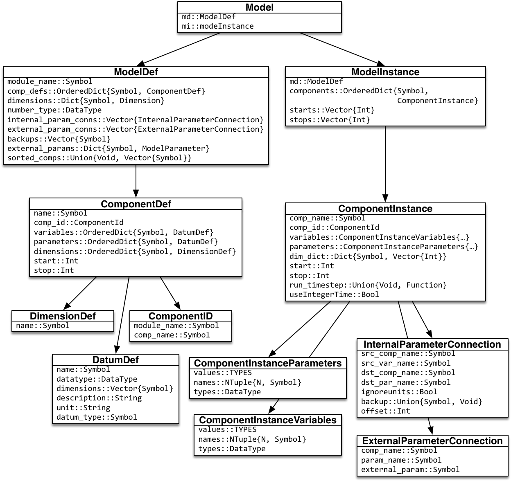

# Mimi Internal Structure

## 1. Code organization

### Types

All Mimi types are defined in `Mimi/src/core/types.jl`.

The types are broadly divided into two categories reflecting "structural definitions" versus "instantiated model info". Structural definition types include:

  * `ModelDef`
  * `ComponentDef`
  * `DatumDef` (used for both variable and parameter definitions)

Instantiated model info types include:

  * `ModelInstance`
  * `ComponentInstance`
  * `ComponentInstanceVariables`
  * `ComponentInstanceParameters`


#### `Model` object
The "user-facing" `Model` no longer directly holds other model information: it now holds a `ModelDef` and, once the model is built, a `ModelInstance`, and delegates all function calls to one or the other of these, as appropriate. The "public" API to models is provided by functions taking a `Model` instance, which are defined in the file `model.jl`.

With this change, all previous "direct" access of data in the `Model` instance are replaced by a functional API. That is, all occurrences of `m.xxx` (where `m::Model`) have been replaced with function calls on `m`, which are then delegated to the `ModelDef` or `ModelInstance`.

To simplify coding the delegated calls, a macro, `@delegate` allows you to write, e.g., 

```
@delegate external_param_conns(m::Model) => mi
```

which translates to:

```
external_param_conns(m::Model) = external_param_conns(m.mi)
```

The right-hand side after `=>` can be `md` or `mi` to indicate delegation to the `ModelDef` or the `ModelInstance`,
respectively. See `model.jl` for numerous examples.


#### Connections

The types `InternalParameterConnection` and `ExternalParameterConnection` are both subtypes of `AbstractConnection`.


#### ComponentInstanceData

`ComponentInstanceVariables` and `ComponentInstanceParameters` are parametric subtypes of `ComponentInstanceData`; the type parameter is a NamedTuple. The names, types, and values of the variables / parameters are encoded in the NamedTuple.

### Component naming

Component definitions are represented by the type `ComponentDef`. The `@defcomp` macro creates a global variable with the name provided as
the first argument to `@defcomp`. Upon evaluation, a variable of this name will hold a `ComponentId`, which stores the symbol names of the module and component. Note: models can be defined in their own module to avoid namespace collisions.



## 3. `@defmodel`

The `@defmodel` macro provides simplified syntax for model creation, eliminating many redundant parameters. For example, you can write:

```
@defmodel my_model begin

    index[time] = 2015:5:2110

    component(grosseconomy)
    component(emissions)

    # Set parameters for the grosseconomy component
    grosseconomy.l = [(1. + 0.015)^t *6404 for t in 1:20]
    grosseconomy.tfp = [(1 + 0.065)^t * 3.57 for t in 1:20]
    grosseconomy.s = ones(20).* 0.22
    grosseconomy.depk = 0.1
    grosseconomy.k0 = 130.0
    grosseconomy.share = 0.3

    # Set parameters for the emissions component
    emissions.sigma = [(1. - 0.05)^t *0.58 for t in 1:20]

    # Connect pararameters (source_variable => destination_parameter)
    grosseconomy.YGROSS => emissions.YGROSS
end
```

which produces these function calls:

```
quote
    my_model = Model()
    set_dimension!(my_model, :time, 2015:5:2110)
    add_comp!(my_model, Main.grosseconomy, :grosseconomy)
    add_comp!(my_model, Main.emissions, :emissions)
    set_param!(my_model, :grosseconomy, :l, [(1.0 + 0.015) ^ t * 6404 for t = 1:20])
    set_param!(my_model, :grosseconomy, :tfp, [(1 + 0.065) ^ t * 3.57 for t = 1:20])
    set_param!(my_model, :grosseconomy, :s, ones(20) * 0.22)
    set_param!(my_model, :grosseconomy, :depk, 0.1)
    set_param!(my_model, :grosseconomy, :k0, 130.0)
    set_param!(my_model, :grosseconomy, :share, 0.3)
    set_param!(my_model, :emissions, :sigma, [(1.0 - 0.05) ^ t * 0.58 for t = 1:20])
    connect_param!(my_model, :emissions, :YGROSS, :grosseconomy, :YGROSS)
end
```
